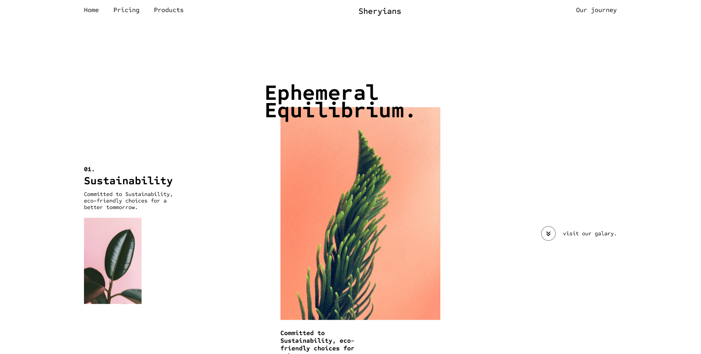
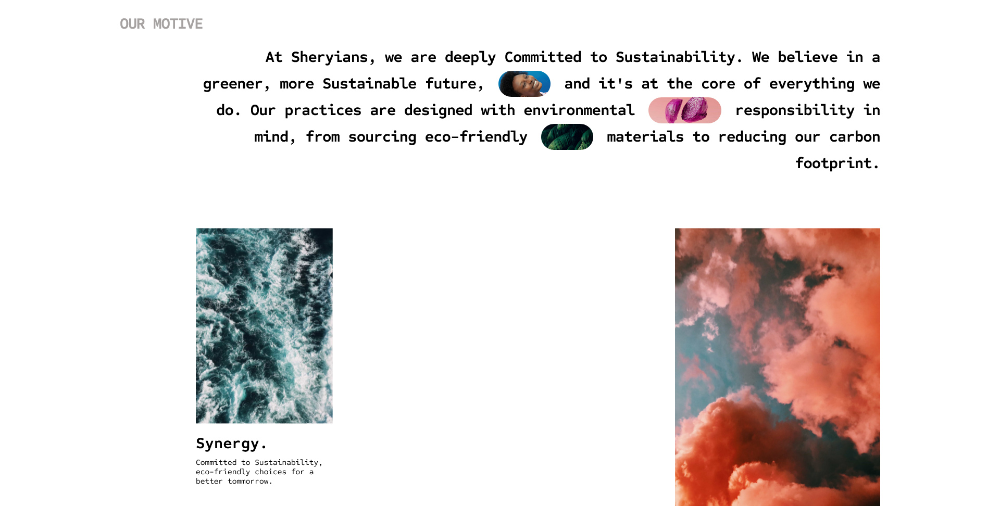

<!-- PROJECT LOGO -->
 

  <h3 align="center">Sheryians Animated Website</h3>
  
This is an animated website created just to learn various animation libraries of the web.

## Table of contents
- [Table of contents](#table-of-contents)
- [About The Project](#about-the-project)
  - [Built With](#built-with)
- [Author](#author)
- [Acknowledgments](#acknowledgments)

## About The Project

This is an animated website which I created to explore various animation libraries on the web inspired by Sheryians Coding School youtube channel.

### Built With

- [GSAP](https://gsap.com/)
- [Shery JS](https://github.com/aayushchouhan24/sheryjs)

## Author

<!--- - Website - [Pradip Chaudhary](https://www.your-site.com) --->
- Frontend Mentor - [@ChaudharyPradip](https://www.frontendmentor.io/profile/ChaudharyPradip)
- Twitter - [@thePradiptalks](https://www.twitter.com/thePradiptalks)

## Acknowledgments

This project was inspired by [Sheryians Coding School](https://www.youtube.com/@thesheryianscodingschool) youtube channel. Their new js library Shery js was really useful in creating the animated images.